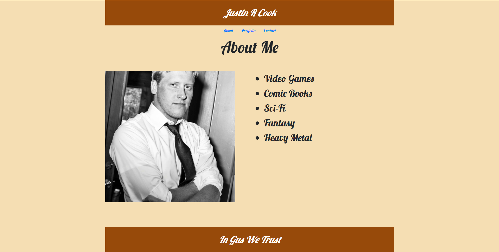
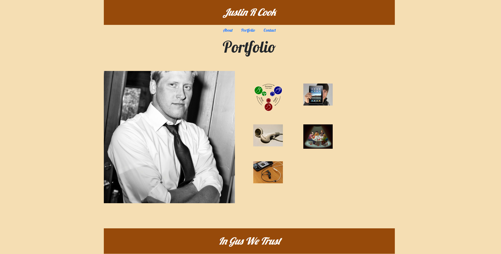
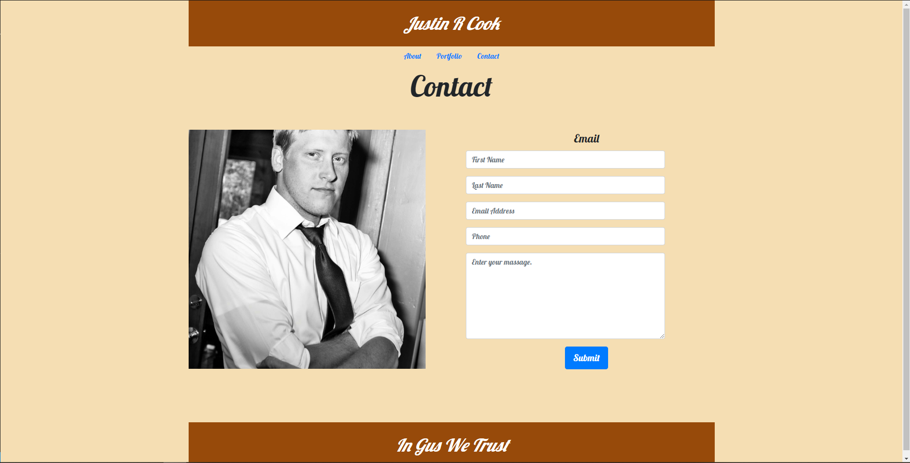

# Bootstrap 4 Responsive Webpage

## About Me Page
    The about me page shows my brief bio with a resposive img and navbar that is also present in the contact and portfolio pages as well.

## Portfolio Page
    The porfolio page is almost the same as the about me, except for 5 pictures, which will be place holders for future projects.  I used a grid system for the pictures as well as made them resposive.  Used a @media screen to get the images to change when screen is at 768px.

## Contact Page
    Again, the contact page is similar to the previous two, except for a contact me form which I took from a google search.
